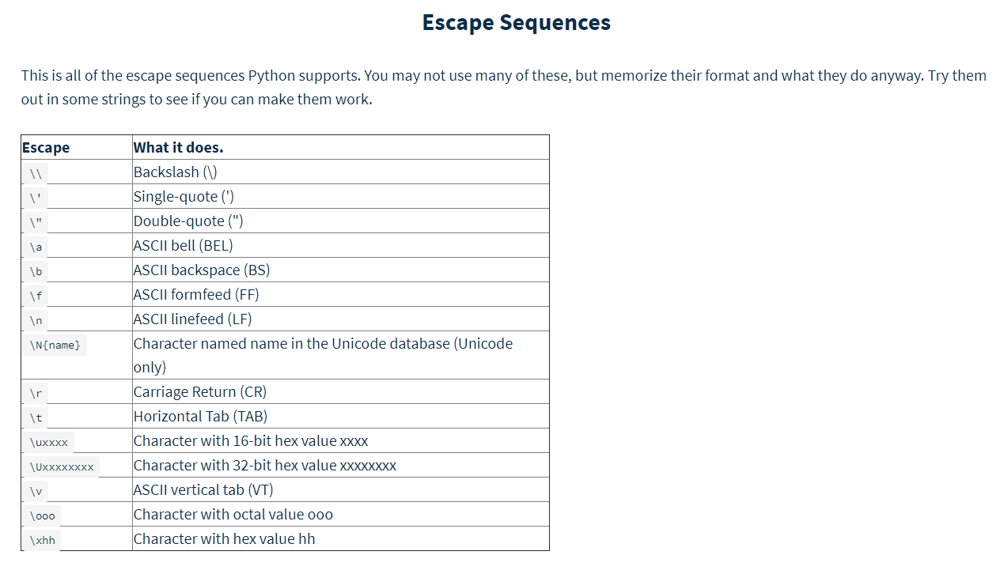
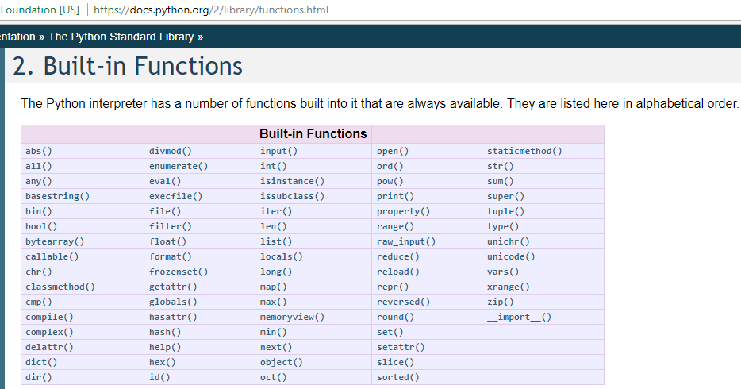

# python-the-hard-way
This is my repo for learning python (the hard way)
While I'm at it, I might as well learn how to maintain code across computers using Git.  In the past, I've used Bitbucket/Stash.
 

 

